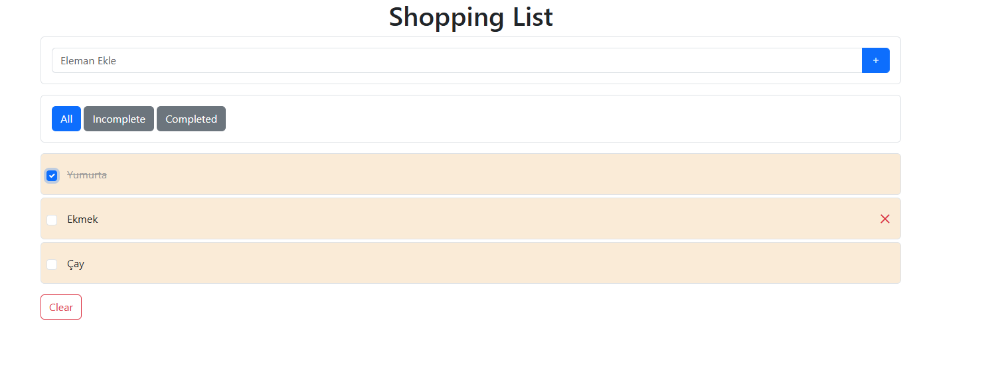

## 🚀 Application Preview

🛒 Shopping List Web Application

Bu proje, HTML, CSS, JavaScript ve Bootstrap 5 kullanılarak geliştirilmiş interaktif bir Alışveriş Listesi uygulamasıdır.

Kullanıcılar ürün ekleyebilir, tamamlandı olarak işaretleyebilir, düzenleyebilir, filtreleyebilir ve silebilir. Veriler LocalStorage kullanılarak tarayıcıda saklanır.

✨ Özellikler

Yeni ürün ekleme

Ürünleri tamamlandı olarak işaretleme

Tamamlanan ürünlerde üzeri çizili görünüm

Ürün adını tıklayarak düzenleme (inline edit)

All / Completed / Incomplete filtreleme sistemi

Ürün silme (çarpı butonu)

Tüm listeyi temizleme (Clear button)

LocalStorage ile veri kalıcılığı

Responsive tasarım (Bootstrap 5)

---------------------------------------------------------------------------------------------------------------------------------------------------------

🛒 Shopping List Web Application

This project is an interactive Shopping List application built using HTML, CSS, JavaScript, and Bootstrap 5.

Users can add items, mark them as completed, edit them inline, filter them, and delete them. Data is stored in the browser using LocalStorage, ensuring persistence.

✨ Features

Add new items

Mark items as completed

Completed items display with a line-through style

Inline editing by clicking on item name

All / Completed / Incomplete filtering system

Delete individual items

Clear entire list

Persistent data using LocalStorage

Responsive design with Bootstrap 5
